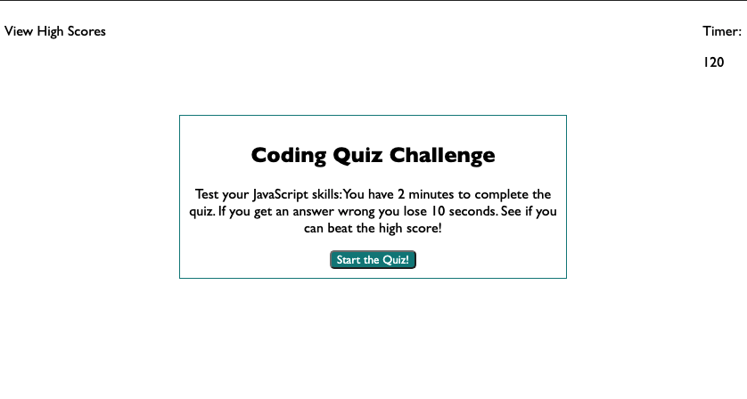
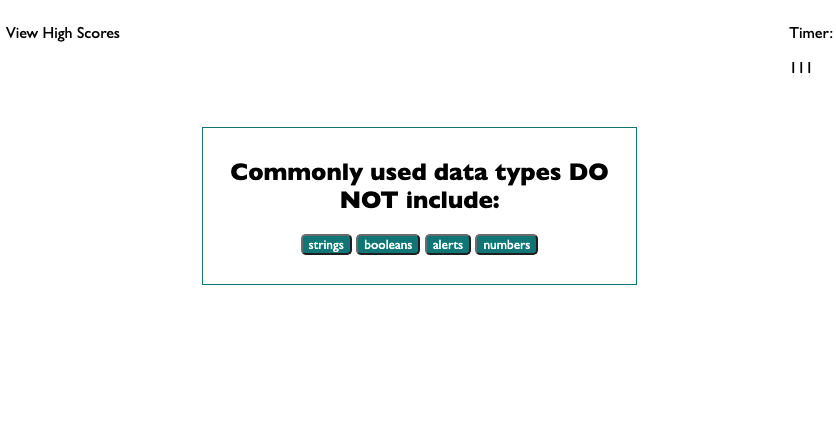
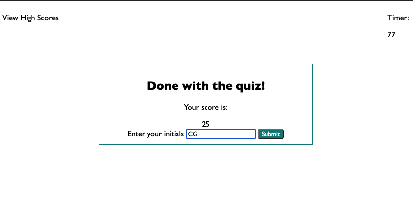

# JavaScript Quiz

URL: placeholder

Purpose: To create a timed quiz about JavaScript basics that allows users to see high scores.

## Description

This application is a short, timed quiz about JavaScript. The user can start the quiz, which sets a timer running with two minutes to complete the quiz. The questions are multiple choice, and the user can only choose one answer before moving on to the next question. If they get the question right it adds 5 points to the score, shows a message on the screen that they got it right, and moves on to the next question. If they get the question wrong it subtracts 10 second from the timer, shows a message on the screen that they got it wrong, and moves on to the next question. 

When the time reaches 0, or if the user completes all the questions the quiz is finished. They go to a page where they can submit their initials along with their score. The scores are saved to a high scores page which can be viewed via the nav bar at the top of the page.

## Visuals

Below are some examples of the look and function of this webpage.

